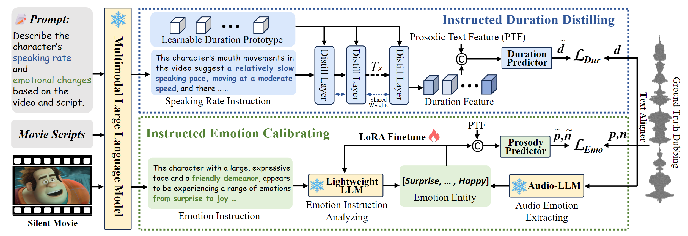

## InstructDubber: Alineación basada en instrucciones para el doblaje de películas en cero pasos

[AAAI'2026] Implementación oficial del artículo "InstructDubber: Alineación basada en instrucciones para el doblaje de películas en cero pasos" (en proceso).



El código y los datos están actualmente en proceso de organización y se publicarán en este repositorio tan pronto como esté todo listo.

## 🗒 Tareas pendientes

- [x] Publicar la demostración de InstructDubber en [este enlace](https://zzdoog.github.io/InstructDubber/).

- [x] Publicar el código de entrenamiento e inferencia.

- [x] Publicar el conjunto de datos de instrucciones de los tres benchmarks.

- [x] Publicar el doblaje generado de cada benchmark y configuración.

- [x] Actualizar el archivo README.md (instrucciones de uso).

- [ ] Publicar los checkpoints y optimizar el uso de la inferencia.

- [ ] Publicar el script de entrenamiento LoRA del módulo de calibración de emociones instruido.


## 🌼 Entorno

Nuestra versión de Python es la 3.10 y la versión de CUDA es la 11.8, aunque también son compatibles versiones anteriores. Tanto el entrenamiento como la inferencia se realizan con PyTorch en una GPU GeForce RTX 4090.

```
conda create -n instructdubber python=3.10
conda activate instructdubber
pip install -r requirements.txt
```


## 📊 Conjunto de datos y generación de instrucciones

A diferencia de enfoques anteriores, no utilizamos características visuales como intermediarias para alinear la duración de la pronunciación y las pistas emocionales en el doblaje con el vídeo. En su lugar, aprovechamos las instrucciones en lenguaje natural generadas por un modelo de lenguaje multimodal avanzado para lograr una alineación precisa.

Adoptamos [LLaVA-NEXT-7B](https://github.com/LLaVA-VL/LLaVA-NeXT) como modelo de lenguaje multimodal para generar las instrucciones, y las instrucciones crudas generadas se encuentran en la carpeta de Instrucciones. A continuación, presentamos el prompt que utilizamos:

Para la instrucción de emoción:
```
El guion del personaje es [El Guion del Doblaje]. Basándonos en el guion y en los cambios en los movimientos de la boca del personaje en el vídeo, ¿cuál es el ritmo de habla? Si hay variaciones en el ritmo, por favor describe la tendencia de estos cambios.
```

Para la instrucción de ritmo de habla:
```
El guion del personaje es [El Guion del Doblaje]. Por favor, analiza los cambios emocionales de los personajes en este vídeo basándose en el contenido del vídeo y el guion.
```

Posteriormente, utilizamos un Codificador de Texto Global (GTE) [Qwen2-1.5B-Instruct](https://huggingface.co/Qwen/Qwen2-1.5B-Instruct) para convertir las instrucciones de alineación en lenguaje natural en representaciones textuales, que luego se emplean para el entrenamiento del modelo.

Cualquiera puede experimentar con otros modelos de lenguaje multimodal o codificadores de texto alternativos. Aquí proporcionamos las características textuales procesadas de los tres conjuntos de datos utilizados en nuestra implementación:

- Benchmark V2C-Animation: [BaiduDrive](https://pan.baidu.com/s/1ms8SOOE8R65Si234K3OuEA) (Contraseña: x7in) / [GoogleDrive]()(en progreso)


- Benchmark GRID: [BaiduDrive](https://pan.baidu.com/s/1hWF9hokpbmmdp_lbbKW8Qw) (código: GRID) / [GoogleDrive]()(en progreso)


- Benchmark Chem: ([BaiduDrive](https://pan.baidu.com/s/1KrMiXNaO5z6B_nDtdtiTcA) (Contraseña: Chem)/ [GoogleDrive]()(en progreso))


## 🔧 Entrenamiento

Es necesario modificar los parámetros de ```data_params``` y la configuración relacionada, y definir el nombre de su experimento ```exp_name``` en el archivo de configuración antes de iniciar el entrenamiento. Se creará un directorio con el mismo nombre que su ```exp_name``` en la carpeta ```output```.

Los checkpoints acústicos preentrenados se proporcionan a continuación. Por favor, descárguelos y actualice la ruta en ```first_stage_path```:

- Checkpoint de primera etapa: [Baidu Drive](https://pan.baidu.com/s/1ZUAjOu4jTkx0znVMBngVKA) (b5wy), [Google Drive](https://drive.google.com/file/d/1HF1Bh44oO8w2EYOfX0H6ZhUHVFhMRJOG/view?usp=drive_link).

Para el Benchmark V2C-Animation:
```
python train_second_instruct.py -p Configs_Instruct/config_denoise.yml
```
Para el Benchmark Chem:
```
python train_second_instruct.py -p Configs_Instruct/config_Chem.yml
```
Para el Benchmark GRID:
```
python train_second_instruct.py -p Configs_Instruct/config_grid.yml
```

## ✍ Inferencia (en progreso)

Dado que la inferencia depende de otros dos modelos de lenguaje multimodal, su implementación está actualmente en desarrollo. Las características de instrucción de emoción proporcionadas son las entidades de emoción reales del audio doblado, por lo que no pueden utilizarse directamente para la inferencia, sino solo para evaluar el rendimiento máximo de la Calibración de Emociones Instruida.

Para los checkpoints entrenados en el benchmark V2C-Animation y el doblaje del vídeo del benchmark V2C-Animation (doblaje dentro del dominio):
```
python inference_v2c_instruct.py -n --epoch 30 --setting V2C
```
Para los checkpoints entrenados en el benchmark V2C-Animation y el doblaje del vídeo del benchmark Chem (doblaje cero pasos V2C2Chem):
```
python inference_v2c_instruct.py -n --epoch 30 --setting Chem
```

A continuación, presentamos el doblaje generado por InstructDubber bajo cada configuración. Si solo desea acceder al audio generado para su comparación, puede descargarlo directamente desde los siguientes enlaces:

|     |   V2C-Animation  |  Chem   |  GRID   |
| --- | --- | --- | --- |
|  V2C-Animation   |  V2C2V2C [Baidu Drive](https://pan.baidu.com/s/16K9S7nUtnURWTdOj9XILbQ) (9xmh)/[Google Drive](https://drive.google.com/file/d/1ZxpO5CszzhvGus574cZW88IaXoClFtEy/view?usp=drive_link) |   V2C2Chem [Baidu Drive](https://pan.baidu.com/s/1o5eCupnWlL3p6DDHdcv7Sw)(29nm)/[Google Drive](https://drive.google.com/file/d/1l0noPeHIWIbTvDwn9xSzLwmjoja2mIEI/view?usp=sharing)  |  V2C2GRID [Baidu Drive](https://pan.baidu.com/s/1cIvwv0XyYh9iBeAb0VVoIw)(mpjk)/[Google Drive](https://drive.google.com/file/d/1TFUDoPjYu8SL1xMOHEObvwKW8BtLw-se/view?usp=sharing)  |
|  Chem   |  Chem2V2C [Baidu Drive](https://pan.baidu.com/s/1zmYgB68V47jj_h1V66uqbA)(dxd5)/[Google Drive](https://drive.google.com/file/d/1dQbiHEJ8zBmpoV-RFN_pE7_wNOyY3ck_/view?usp=sharing)  |  Chem2Chem [Baidu Drive](https://pan.baidu.com/s/1E_qkcj79t9dpHNTDICL87w)(i2r4)/[Google Drive](https://drive.google.com/file/d/1JqOTnU6kYekW3WvwF_sHthmr0NBEvA7M/view?usp=sharing)  |  Chem2GRID [Baidu Drive](https://pan.baidu.com/s/1UWlRGv9OcRjkkIsPih9Mow)(mda6)/[Google Drive](https://drive.google.com/file/d/1KBGWOQqISeeMf69m9-LKtVbN3wD4VQ_X/view?usp=sharing) |
|   GRID  |  GRID2V2C [Baidu Drive](https://pan.baidu.com/s/1zeYPB6OR0sUcY-tzs9AhsA)(hhah)/[Google Drive](https://drive.google.com/file/d/14pHx-tRb371RAj0edzmT3Lw-uW6zO0Wz/view?usp=sharing)  |  GRID2Chem [Baidu Drive](https://pan.baidu.com/s/1__vFUqQX2IwsMGbdqD6c5A)(vsmr)/[Google Drive](https://drive.google.com/file/d/1CchuZJ7c0BFHWrD0lCruK5uxc432Tjc4/view?usp=sharing)  |  GRID2GRID  [Baidu Drive](https://pan.baidu.com/s/16aHrbhjpclWvi8r5jBCf7g)(mzbc)/[Google Drive](https://drive.google.com/file/d/1fsw0JY8b5yd3hZjsAfDCAIgkfRP6x5VQ/view?usp=drive_link) |


## 🙏 Agradecimientos
Queremos agradecer a los autores de proyectos relacionados anteriores por compartir generosamente su código y conocimientos: [StyleTTS](https://github.com/yl4579/StyleTTS), [StyleTTS2](https://github.com/yl4579/StyleTTS2), [LLaVA-NEXT](https://github.com/LLaVA-VL/LLaVA-NeXT), [VideoLLaMA3](https://github.com/DAMO-NLP-SG/VideoLLaMA3), [Qwen-2.5](), [Qwen2.5-Omni](https://arxiv.org/abs/2412.15115), y los diversos GTE del equipo Qwen.


## 🤝 Cita
Si considera que nuestro trabajo es útil, por favor cite:
```
@article{zhang2025instructdubber,
  title={InstructDubber: Alineación basada en instrucciones para el doblaje de películas en cero pasos},
  author={Zhang, Zhedong y Li, Liang y Cong, Gaoxiang y Liu, Chunshan y Gao, Yuhan y Wang, Xiaowan y Gu, Tao y Qi, Yuankai},
  journal={arXiv preprint arXiv:2512.17154},
  year={2025}
}
```
