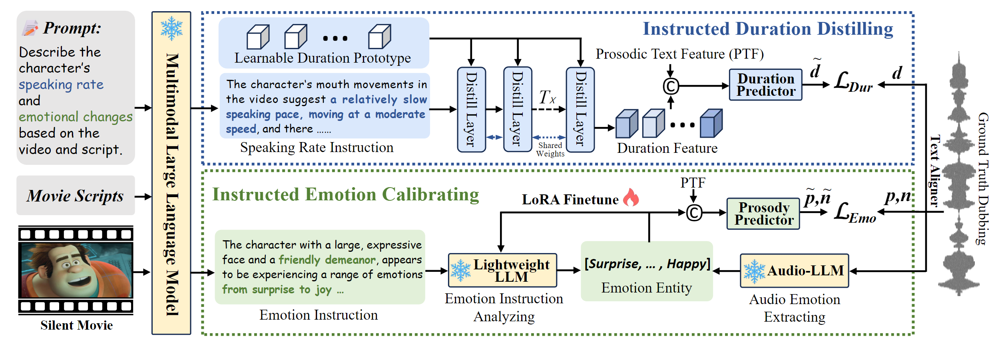

## InstructDubber: Instruction-based Alignment for Zero-shot Movie Dubbing

[AAAI'2026] Official implementation of paper "InstructDubber: Instruction-based Alignment for Zero-shot Movie Dubbing"

The code and data are currently being organized and will be released to this repository as soon as the preparation is complete.

